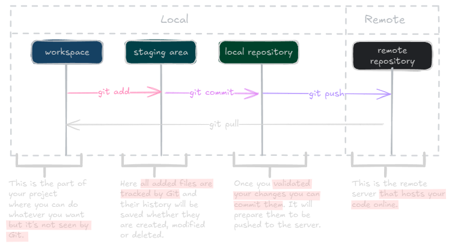

## About This 101

In professional development and large team projects, developers will inevitably rely on Version Control Systems (VCS). While these tools are powerful and significantly enhance productivity, their extensive features can sometimes feel overwhelming or intimidating.
This Git primer guide serves as an introduction to Git commands, covering both beginner and advanced topics. Our goal is to help you feel confident and at ease when initializing, updating, or resolving conflicts in a project showing that Git is neither as complex nor as daunting as it may seem.
Each command and scenario is detailed in a comprehensive cheat sheet, complete with examples and illustrations for clarity.

## Why Git

Git is a powerful tool designed to manage versions of a same content, whether it’s code, articles, or entire projects. In any project, nothing is ever set in stone things evolve, and with evolution comes the possibility of mistakes.
It’s quite common to need to revert to a previous version to understand the origin of a bug, fix a typo or error, or recover something accidentally deleted. This is where Git comes in. It offers a comprehensive set of tools to manage these tasks effectively.
Git is primarily accessed through a command-line interface (CLI), which provides powerful functionality, though many user-friendly graphical user interfaces (GUIs) have emerged to make Git even more accessible.

> More on these interfaces here --> [[A note on Git GUIs]].

## Understand Git

Before diving into commands and setup it's important to understand how Git works and what defines this tool.
You can refer at the diagram underneath to better visualize the different steps that will be involved while you track your files in a project.

The first component of this architecture is the workspace. It's the place where your project lives locally. the place where you will be able to create, edit or delete any file. `Any files here are not tracked by git if you didn't add them before`.

The second component is the staging area. Every files `added` here are tracked by Git and you will be able to manage them directly with Git.

The third part of this architecture is your local clone of the repository (Called local repository). Files sent there doesn't not appear anymore into the staging area and are ready to be pushed to your remote repository. It's one of the last step before your content is delivered to the server and made available for other contributors.

> the next section is about Git history, it's not mandatory to read it. It's just for common culture.

Next : [[2 - Setup a project]]

## Git History
