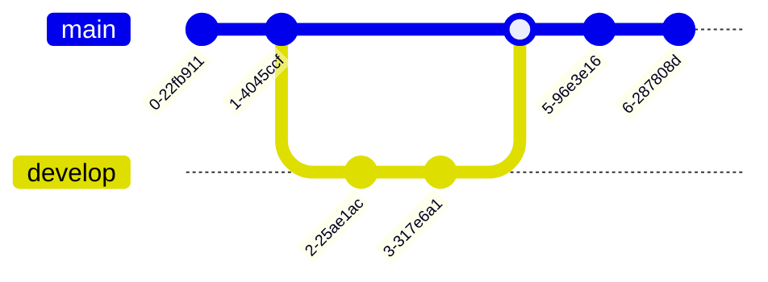
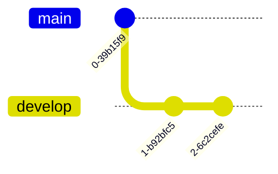
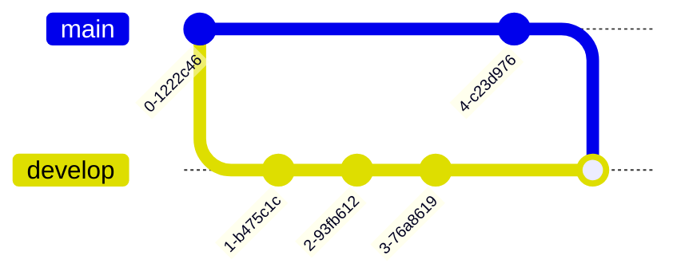

## Where to start

When starting a project with Git, you can approach it from various entry points. You might begin with a classic setup, such as creating an empty repository on GitHub or GitLab. Alternatively, you may already have a project on your local machine that you want to host on a remote repository. Another common scenario is joining an existing project hosted remotely. Lastly, you might have a project on your local machine and a separate repository on your hosting platform, requiring synchronization to align the two.

While these options might seem overwhelming initially, the process always follows the same core methodology, which can be applied consistently across all these scenarios.

Before covering all these cases in a generic flow chart let's see fist a set of useful commands to start a project. 

```sh
git init # Init a git repositoiry from a directory on your local machine
```

```sh
git clone <remote-repository-url> # Clone a remote hosted git repository on your local machine
```

##  Global configurations

Sometimes Git will also ask you more about yourself in order to configure your profile across all your repositories. 

To configure your username you can use this command :

```sh
git config --global user.name "firstname lastname"
```

To configure your contact email you can use this command :

```sh
git config --global user.email "your email"
```

## Checking your remotes

When setting up a new repository, you may also need to configure a remote. A remote is the URL of the repository hosted on your server. To enable Git to know where to send your project when you commit and push, you need to add a remote. 

This can be accomplished using the following command:

```sh
git remote add <remote-name> <remote-url> 
```

A common remote name is origin. For this reason you might often encounter the example `git remote add origin <url>` but origin is just a name and you could use anything instead. 

To list all already existing origins on your project you can use the command : 

```sh
git remotes -v # This will list all configured romote for your current repository
```

With Git, you can take your configuration even further by adding multiple remotes, enabling you to fetch or push code to various repositories or platforms. This approach allows you to back up your code across different platforms for example or facilitate resource sharing among multiple teams, making collaboration and redundancy more efficient.
Looking for configured remotes is a good habit in order to check that you are interacting with the right repository and work with well configured remotes. 

## Creating a branch


Branching is maybe the most important feature in Git. It allows you to create temporary workspace for a bug or a feature in your project that can later be merged to a bigger codebase to integrate your changes. 

From Git [documentation](https://git-scm.com/book/en/v2/Git-Branching-Branches-in-a-Nutshell) you can read : 

_“ Branching means you diverge from the main line of development and continue to do work without messing with that main line.”_

To create a new branch the command is : 

```sh
git branch <branch-name>
```

You will then need to move to this new branch in order to work on it. 
You can do it by running : 

```sh
git checkout <new-branch>
```

An illustration of this action would look like this -after you added some commits on your new branch-.


You can also create a branch and switch to it using this command : 

```sh
git checkout -b <new-branch>
```

## Staying up to date



When working on a project you will add some changes on your side but you will also likely be part of a bigger team that will also perform multiple modifications. In order to remain up to date with your project version you need to get the changes from your teammates into your local workspace / branch. 

There are multiple way to get the changes from the remote. Here is a breakdown. 

```sh 
# Fetch changes from al branches configured on remote origin
git fetch
```

Fetch command allows to get changes from all branches targeting the default remote 
-usually origin- without modifying your working directory. It means that it will not merge automatically all the changes into your local branch. In order to integrate all the changes you will need to execute this command : 

```sh
git merge
```

The will perform global update on your local branch -ie integrating all branches of the remote-. Sometimes you will want to get the changes from only certain branches -and not all the features others people are working on-.
In order to do so you can run this set if commands : 

```sh
git fetch <remote> <branch-name>
# E.g git fetch origin main
git merge <remote/branch>
# E.g git merge origin/main
```

Notice, in the previous commands, the two different notations `origin main` and `origin/main`.

the difference can be explained by what is being targeted in the commands. 
`origin main` fetches the latest updates from the `main` branch on the `origin` remote.
This notation is used with `git fetch` / `git push` / `git pull` among others.

`origin/main` target the state of the remote `main` branch (stored in your local copy as `origin/main`) into your current branch.
This notation is used with `git merge` / `git rebase`

Here is a recap :

| Concept        | `origin main`                 | `origin/main`                 |
|---------------|--------------------------------|--------------------------------|
| **Type**      | Remote + Branch               | Remote-tracking branch (local) |
| **Usage**     | With `git fetch` / `git push` | With `git merge` / `git rebase` |
| **Purpose**   | Fetch/push to remote branch   | Reference to remote branch state |


Next : [[3 - Managing files in the project]] 