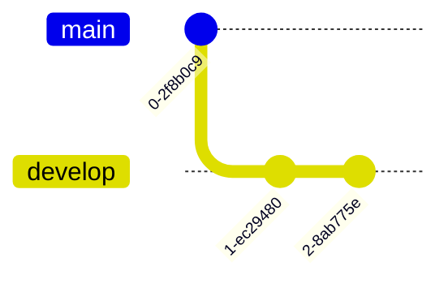

## Where to start

When starting a project with Git, you can approach it from various entry points. You might begin with a classic setup, such as creating an empty repository on GitHub or GitLab. Alternatively, you may already have a project on your local machine that you want to host on a remote repository. Another common scenario is joining an existing project hosted remotely. Lastly, you might have a project on your local machine and a separate repository on your hosting platform, requiring synchronization to align the two.

While these options might seem overwhelming initially, the process always follows the same core methodology, which can be applied consistently across all these scenarios.

Before covering all these cases in a generic flow chart let's see fist a set of useful commands to start a project. 

```sh
git init # Init a git repositoiry from a directory on your local machine
```

```sh
git clone <remote-repository-url> # Clone a remote hosted git repository on your local machine
```

##  Global configurations

Sometimes Git will also ask you more about yourself in order to configure your profile across all your repositories. 

To configure your username you can use this command :

```sh
git config --global user.name "firstname lastname"
```

To configure your contact email you can use this command :

```sh
git config --global user.email "your email"
```

## Checking your remotes

When setting up a new repository, you may also need to configure a remote. A remote is the URL of the repository hosted on your server. To enable Git to know where to send your project when you commit and push, you need to add a remote. 

This can be accomplished using the following command:

```sh
git remote add <remote-name> <remote-url> 
```

A common remote name is origin. For this reason you might often encounter the example `git remote add origin <url>` but origin is just a name and you could use anything instead. 

To list all already existing origins on your project you can use the command : 

```sh
git remotes -v # This will list all configured romote for your current repository
```

With Git, you can take your configuration even further by adding multiple remotes, enabling you to fetch or push code to various repositories or platforms. This approach allows you to back up your code across different platforms for example or facilitate resource sharing among multiple teams, making collaboration and redundancy more efficient.
Looking for configured remotes is a good habit in order to check that you are interacting with the right repository and work with well configured remotes. 

## Creating a branch


Branching is maybe the most important feature in Git. It allows you to create temporary workspace for a bug or a feature in your project that can later be merged to a bigger codebase to integrate your changes. 

To create a new branch the command is : 

```sh
git branch <branch-name>
```

You will then need to move to this new branch in order to work on it. 
You can do it by running : 

```sh
git checkout <new-branch>
```

An illustration of this action would look like this (after you added some commits on your new branch).



Next : [[3 - Managing files in the project]] 