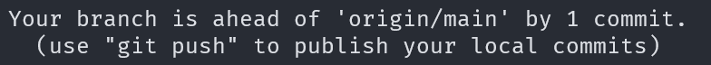
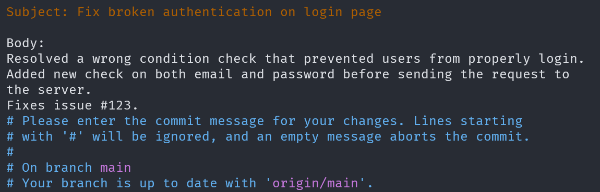

## Introduction

As discussed in the first course, [[1 - As a beginning]],  you now have a clear understanding of the various stages involved in managing updates with Git. 
During development, you may need to add, remove, or modify files within your local repository. Eventually, you will want to commit these changes to incorporate them into the project's official version, enabling other contributors to integrate them into their local repositories.

## Get project status

To track the changes made to your project, it’s essential to review the current status of your work. 
Git provides a way to view the state of your project’s file structure and modifications. You can do this by running the following command:

```sh
git status
```

This is undoubtedly one of the most frequently used commands in Git. It displays the status of your files, categorizing them using color codes. Files not tracked by Git appear in red (indicating they are in the workspace), staged files are shown in green (indicating they are in the staging area), and committed files generate a status message confirming their successful inclusion in the repository.



## Add your changes

Similarly to checking the status of your project, you may also want to move your local changes to the staging area. This step allows Git to recognize these changes, enabling you to perform various operations, such as committing them, resetting them, or discarding them if they are no longer needed. To achieve this, Git provides the following command:

```sh
git add <directory> # This command stages all unstaged changes within the specified directory, moving them to the staging area and preparing them for the next commit.
```

Most of the time, you'll run the command as `git add .`, which stages all changes at once. However, there may be instances where you need to add specific files individually. This can be accomplished using the following command:

```sh 
git add <file_1> <file_2> <file_3> # Notice the space between each filename. 
```

This approach allows you to selectively choose which files are ready for the next commit, while keeping others in the workspace for further modification. 

For more advanced use, Git also provides a command that allows you to add all files except one (or a specific list), giving you finer control over what gets staged for commit.

```sh
git add . :^file_1 :^file_2
```

This unusual notation instructs Git that the file following the negation operator `:^` should not be moved from the workspace to the staging area. It effectively excludes that file from being staged while allowing others to be added. 
You will find more on this in the [[6 - Advanced topics]] course. 

## Committing your changes 

The next step following the previous Git commands is to commit your changes, preparing them to be pushed to the remote repository. To do this, you can run the following command:

```sh 
git commit [-m] "your commit message"
```

It is strongly recommended to include a commit message, as this helps you and your collaborators understand the changes made to the project. We will revisit this topic in a later section, specifically in [[7 - Git guidelines]].

You are not required to use the `-m` option with the `git commit` command. Instead, you can run `git commit` without it, and a text editor of your choice will open, allowing you to write a more detailed commit message. Here's an example of what it might look like:




## Resetting staged changes 

Sometimes, instead of committing your changes, you may want to reset them to continue working on them or remove them from the project entirely. To do this, you can run the following command:

```sh
git reset <file_1>
```

This will remove the specified file from the staging area. Alternatively, you can reset all files in the staging area by running `git reset`, which will unstage all changes, allowing you to continue working on them or discard them as needed.

> Note : This command will simply remove the files from the staging area and place them back in your workspace. All your changes will remain intact, and you'll be able to continue working on them without losing any progress.

The `reset` command can be quite complex, as it allows you to perform various actions that can significantly impact your work. We will explore these advanced features in more detail in [[6 - Advanced topics]]
