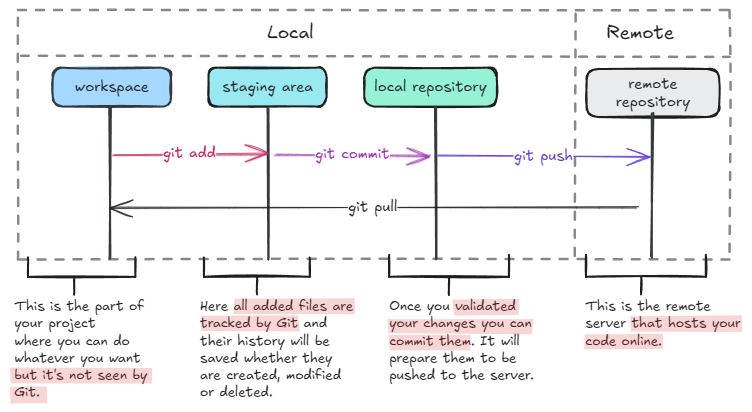

## Understand Git areas

Git is designed to work with multiple areas, each serving a specific purpose in the version control process. Understanding these areas will give you deeper insight into what happens when you execute Git commands.

Here’s a basic Git workflow that involves the most common and essential commands.

### The working directory

The working directory contains all the files in your project. Both tracked and untracked. Tracked files are those already under Git’s version control, while untracked files are newly created files that Git does not yet manage.

Any file that exists in the working directory but has not been added to Git is considered untracked. This allows you to control which files should be included in version control.

To check the status of your working directory, use:

```sh
git status
```

### The staging area

Before committing changes, you must first move them to the staging area. This step allows you to carefully prepare what will be included in your next commit. It helps in organizing changes logically rather than committing everything at once.

To add files to the staging area, use:

```sh
git add <file1> <file2>
```

Or to stage everything at once:

```sh
git add .
```

### The local repository

Once files are staged, they are ready to be committed to your local repository. A commit is a snapshot of your project at a specific point in time along with a meaningful message that describes the changes.

To commit staged files, use:

```sh
git commit -m "Your commit message"
```

At this stage, the changes are recorded in the local repository but are not yet shared with others.

### The remote repository

The remote repository is where your project is stored online, making it accessible to other team members. It typically resides on platforms like GitHub, GitLab, or Bitbucket.

To upload your commits from the local repository to the remote repository, use:

```sh
git push origin <branch-name>
```

If you want to fetch the latest changes from the remote repository without merging them automatically, use:

```sh
git fetch origin <branch-name>
```

To fetch and merge the latest changes in one step, use:

```sh
git pull origin <branch-name>
```

Here is a recap of what we discussed in this section.


