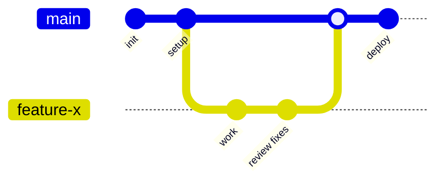

## Git Best Practices

Knowing the commands is half the journey. The other half is using them in a way that keeps your project readable and your teammates happy. None of these practices are enforced by Git itself, they're habits that separate a confusing repository from a pleasant one to work in.

## Writing good commit messages

A commit message is a note to your future self and your teammates explaining **why** a change happened. Six months from now, "fix stuff" tells you nothing, while "Fix login redirect loop on expired sessions" tells you everything.

A widely adopted structure looks like this:

```
<type>: <short summary in the imperative mood>

<optional longer body explaining the why, not the how>
```

A few guidelines that consistently pay off:

- Write the summary in the **imperative mood**: "Add", "Fix", "Remove", as if completing the sentence "This commit will...".
- Keep the summary line short (around 50 characters) and don't end it with a period.
- Use the body to explain **why** the change was needed, not to restate what the diff already shows.
- Make each commit one logical change. If you find yourself writing "and" in the summary, it might be two commits.

Many teams adopt the [Conventional Commits](https://www.conventionalcommits.org/) format, which prefixes the summary with a type:

```
feat: add password reset flow
fix: prevent crash when cart is empty
docs: update installation steps
refactor: extract validation into helper
chore: bump dependencies
```

The payoff is real: tools can read these prefixes to automatically generate changelogs and decide version numbers. And as we saw in [Chapter 9](/git-primer/hooks-automation/), a `commit-msg` hook can gently enforce the format for you.

## Keeping a clean commit history

A clean history is one you can actually read and reason about. You don't need to be obsessive, but a few habits make a big difference.

**Commit small and often, then tidy before sharing.** While you work, commit freely, even messy "wip" commits. Before you push or open a pull request, use the interactive rebase from [Chapter 8](/git-primer/advanced-commands/) to squash the noise into meaningful commits:

```sh
git rebase -i HEAD~5
```

**Never commit generated files, secrets, or local clutter.** This is what `.gitignore` is for. List the files and folders Git should ignore, one pattern per line:

```
# Dependencies
node_modules/

# Environment and secrets
.env

# Build output
dist/
build/

# OS and editor noise
.DS_Store
.vscode/
```

:::caution
If you ever commit a secret like an API key, removing it in a later commit is **not enough**, it still lives in history. Rotate the secret immediately and, as mentioned in [Chapter 6](/git-primer/undoing-changes/), use a history-rewriting tool to scrub it.
:::

**Prefer `revert` over `reset` on shared branches.** Undoing a public commit should add a new commit, not rewrite what others have already pulled.

## Git workflows (Git Flow, Trunk-based, GitHub Flow)

A workflow is the agreed-upon set of rules for how your team uses branches. There's no single best one, the right choice depends on your team size and how often you release. Here are the three you'll meet most often.

### GitHub Flow

The simplest and most popular for web projects and continuous deployment. There's one long-lived branch, `main`, which is always deployable. For any change you:

1. Branch off `main` (`git switch -c feature-x`).
2. Commit your work and push.
3. Open a pull request for review.
4. Merge back into `main` and deploy.



It's easy to learn and fast, which is why most small-to-medium teams use it.

### Trunk-based development

A close cousin favored by teams that ship many times a day. Everyone integrates into `main` (the "trunk") very frequently, often through short-lived branches that live for hours, not days. Big or risky features hide behind **feature flags** rather than long-running branches. This keeps painful integration conflicts to a minimum, but it relies heavily on strong automated testing.

### Git Flow

A more structured model designed for projects with scheduled releases and multiple versions in the wild. It uses several long-lived branches with strict roles:

- `main` holds production-ready, released code.
- `develop` is the integration branch for the next release.
- `feature/*` branches come off `develop` for new work.
- `release/*` branches prepare a version for shipping.
- `hotfix/*` branches patch production urgently off `main`.

Git Flow is powerful but heavy. For most modern teams practicing continuous delivery, it's more ceremony than they need, and GitHub Flow or trunk-based development is a better fit.

### Which one should you pick?

| Workflow            | Best for                                  | Complexity |
| ------------------- | ----------------------------------------- | ---------- |
| **GitHub Flow**     | Web apps, continuous deployment, most teams | Low        |
| **Trunk-based**     | High-velocity teams shipping many times a day | Medium     |
| **Git Flow**        | Versioned software with scheduled releases | High       |

:::tip
Start simple. Most teams are best served by GitHub Flow and should only reach for something heavier when they feel a concrete pain that the simpler model can't solve.
:::
