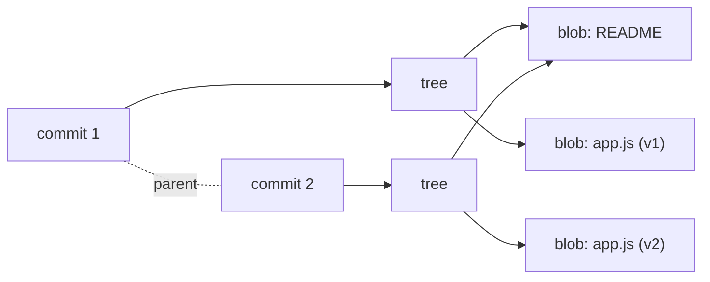

import ObjectModel from '../../components/ObjectModel.svelte';
import HashObject from '../../components/HashObject.svelte';
import Packfile from '../../components/Packfile.svelte';
import CommitBlockchain from '../../components/CommitBlockchain.svelte';
import HeadRefsTimeline from '../../components/HeadRefsTimeline.svelte';

## The Git object model (blobs, trees, commits)

From this point on, we'll dive into more advanced Git concepts. If you need more time, feel free to review Chapters 1 to 6 before proceeding.

The beauty of Git lies in its ability to handle complex operations while maintaining a simple core. At its foundation, Git stores everything as one of just **four object types**:

- **`blob`** stores the **content of a file**. It does not record the filename or where the file lives, only the bytes inside it.
- **`tree`** represents a **directory**. It maps names to the blobs (files) and other trees (subdirectories) it contains.
- **`commit`** points to **one tree** (a full snapshot of your project) plus metadata: author, committer, message, and the hash of its parent commit(s).
- **`tag`** marks a specific commit as important, usually a release. A **lightweight** tag is just a named pointer; an **annotated** tag is its own object with author, date, and a message.

Every object, whatever its type, is made of three things: a **type**, the **size** of its content, and the **content** itself. That uniformity is what keeps the core so small. Step through how a single commit references your whole project:

<ObjectModel client:visible />

Together these objects form a **versioned filesystem** layered on top of your real one. That is the whole trick: Git is a content tracker built from four tiny building blocks.

## Everything is content-addressed

Here is the idea that ties the whole object model together: Git stores each object under a name **computed from its content**. That name is the SHA-1 hash of the object's header (`<type> <size>\0`) followed by its content. This is called **content-addressable storage**.

You can compute it yourself with the plumbing command `git hash-object`:

```sh
printf 'Hello, Git!\n' | git hash-object --stdin
# 670a245535fe6316eb2316c1103b1a88bb519334
```

Try it live below. Edit the content and watch the object id change. This computes the **exact** id that real Git would use, byte for byte:

<HashObject client:visible />

Two consequences fall out of this, and they explain a lot of Git's behavior:

- **Identical content is stored once.** If two files (or the same file across many commits) have the same bytes, they hash to the same id, so Git keeps a single blob and everything points at it. That is why committing an unchanged file again costs nothing.
- **Tampering is detectable.** Change one byte and the hash changes. Since an object's name *is* its fingerprint, you cannot quietly alter stored content without Git noticing.

To look inside any object by its id, use `git cat-file`:

```sh
git cat-file -t 670a2455   # -t prints the TYPE:  blob
git cat-file -p 670a2455   # -p PRETTY-prints the content:  Hello, Git!
```

A commit, printed the same way, is just plain text pointing at a tree and a parent:

```sh
git cat-file -p HEAD
# tree 26d3f4bd799ec02f84eb58865f5537a7b1733660
# author  tester <a@b.c> 1700000000 +0000
# committer tester <a@b.c> 1700000000 +0000
#
# Add greeting
```

> 💡 The short hashes you see in `git log` (like `670a2455`) are just the first 7 characters of the full 40. Git lets you use any unambiguous prefix, so you rarely type the whole thing.

## How Git stores changes (snapshots vs. diffs)

This is one of the biggest "aha" moments when learning Git internals, and it's where Git differs from most older version control systems.

Many tools (like Subversion) think in terms of **diffs**: they store the original file, then a list of changes (deltas) applied on top of it over time. To know what a file looks like at a given version, the system replays every change from the beginning.

Git thinks in **snapshots**. Every time you commit, Git records what all your tracked files look like at that moment (a tree of blobs) and stores a reference to that snapshot. It's like a stream of mini filesystems, one per commit.



Because of content-addressing, a file that did not change between two commits is **not** stored twice. Both trees just point at the identical blob (notice how both trees above reuse the same README blob). So snapshots stay lightweight even on large projects.

This is why switching branches or viewing an old version is so fast: Git doesn't rebuild your files by replaying diffs, it reads the snapshot that already exists. When Git *shows* you a diff (for example in `git log -p`), it computes that difference on the fly by comparing two snapshots. That is a presentation detail, not how the data is stored.

## Packfiles: how snapshots stay small

If Git keeps a full snapshot per commit, won't the repository balloon? This is where the honest, more detailed answer lives, and it's worth understanding because it reconciles "snapshots" with the reality on disk.

When you first create objects, Git writes each one as its own file, **zlib-compressed**, under `.git/objects/`. These are called **loose objects**. The filename is the object's hash, split so the first two characters are a directory:

```sh
# the blob for greeting.txt lives at:
.git/objects/67/0a245535fe6316eb2316c1103b1a88bb519334
```

As history grows, Git periodically runs **garbage collection** (`git gc`, also triggered automatically) and rolls many loose objects into a single **packfile**: a `.pack` file holding the objects, plus a `.idx` index so Git can still jump straight to any one of them. Inside a pack, similar objects (for example successive versions of the same file) are stored as **deltas** against one another, then compressed.

<Packfile client:visible />

So both mental models are true at once: the **logical model** is snapshots (a commit always refers to a complete tree), while the **physical storage** uses delta compression to keep things tiny. The crucial difference from a diff-based system is that Git's deltas are an internal storage choice, picked freely between any two similar objects and kept in short chains. Git never has to replay your entire history to reconstruct a file.

## A tour of the `.git` directory

All of this lives inside the hidden `.git` folder at the root of your repository. Right after `git init` (and a first `git add`), it looks like this:

```sh
.git/
├── HEAD          # which branch you are on  ->  ref: refs/heads/main
├── config        # this repository's configuration
├── description   # only used by GitWeb, ignore it
├── index         # the staging area (a binary file)
├── hooks/        # sample hook scripts (see Chapter 9)
├── info/         # extra config, e.g. a global-style exclude file
├── objects/      # every blob, tree, commit and tag lives here
└── refs/         # branches (refs/heads) and tags (refs/tags)
```

A few entries that students often expect to see are **not** there yet: `logs/`, `FETCH_HEAD`, `ORIG_HEAD`, and `COMMIT_EDITMSG` only appear once you actually move a reference, fetch, reset, or commit. A `packed-refs` file shows up after Git packs your refs. In other words, `.git` grows the machinery as you use it.

### The index (your staging area, on disk)

The **staging area** you met back in [Chapter 3](/git-primer/basic-workflow/) is not an abstract idea, it is the real binary file `.git/index`. It holds the exact list of blobs that will go into your **next** commit. You can read it in plain text with another plumbing command:

```sh
git ls-files --stage
# 100644 670a245535fe6316eb2316c1103b1a88bb519334 0	greeting.txt
#  ^mode  ^blob hash (matches git hash-object!)    ^stage ^path
```

Notice the blob hash is the same `670a2455` we computed earlier. Staging a file really means "hash its content into a blob and record that id in the index." Committing then freezes the index into a tree.

## Commits form a chain, like a blockchain

Here is one of the most useful mental models for Git: a commit behaves a lot like a block in a blockchain.

Every commit's hash is computed from its content: its tree (the snapshot), its author, its message, and, crucially, **the hash of its parent commit**. Because the parent's hash is baked into the child, the commits form a tamper-evident chain. Change anything in an old commit and its hash changes, which changes the "parent" recorded in the next commit, which changes that commit's hash too, and so on, all the way to the tip.

Try it yourself. Edit a message in an early block, or hit "Tamper with commit #0", and watch the change re-hash down the chain:

<CommitBlockchain client:only="svelte" />

This is exactly why you cannot quietly rewrite shared history. The moment you change an old commit, every later commit gets a new hash, and anyone who already has the original chain will spot the mismatch.

> 📖 The demo is simplified to keep the focus on the chaining. A real commit object has the form `commit <size>\0tree <hash>\nparent <hash>\nauthor ...\ncommitter ...\n\n<message>`, and that whole thing is what gets hashed. The principle is identical: the parent's hash is part of what gets hashed, so history is cryptographically chained.

## Git references (HEAD, refs, tags)

Objects are addressed by their 40-character hash, like `516cdb49934cdeea7131fe5baf0f44c871cbb3de`. Nobody wants to type that. **References** (or "refs") are human-friendly names that point to those hashes, and Git uses them everywhere.

### Branches

A **branch is simply a lightweight, movable pointer to a commit**. It lives as a tiny file under `.git/refs/heads/` whose entire contents is one hash:

```sh
cat .git/refs/heads/main
# 516cdb49934cdeea7131fe5baf0f44c871cbb3de
```

When you make a new commit, Git updates that file to point to the new commit. That is literally all a branch is, which is why creating and deleting branches in Git is so cheap.

### HEAD

`HEAD` answers the question "where am I right now?". In most cases it doesn't point directly to a commit, it points to the branch you currently have checked out:

```sh
cat .git/HEAD
# ref: refs/heads/main
```

This indirection is what lets Git know which branch should move forward when you commit. As mentioned in [Chapter 2](/git-primer/setup/), if `HEAD` points straight at a commit instead of a branch, you are in a **detached HEAD** state.

Pointers are much easier to understand once you watch them move. Step through committing, switching branches, and detaching HEAD below. Pay attention to what moves: in many steps, only the pointers change, no files are copied:

<HeadRefsTimeline client:visible />

### Tags

A tag is a reference that points to a specific commit and, unlike a branch, is **not** meant to move. Tags are how you mark meaningful points in history, most commonly releases.

```sh
# Lightweight tag: just a named pointer to a commit
git tag v1.0.0

# Annotated tag: stores extra metadata (author, date, message) as its own object
git tag -a v1.0.0 -m "First stable release"
```

Annotated tags are recommended for releases because they record who created the tag and when. Tags are **not** pushed by default, so share them explicitly:

```sh
git push origin --tags
```

### Putting it together

All of these references live under `.git/refs/`:

- `refs/heads/` holds your local branches.
- `refs/remotes/` holds your view of the remote branches (like `origin/main`).
- `refs/tags/` holds your tags.

So when you read a command like `git log main`, Git looks up `refs/heads/main`, finds the commit it points to, follows the parent links, and walks back through the snapshots. Once you see refs as nothing more than named pointers to commits, a lot of Git's "magic" stops feeling like magic.

## Plumbing vs. porcelain

You may have noticed two flavors of command in this chapter. Git splits its commands into two layers:

- **Porcelain** commands are the friendly, everyday ones built for humans: `git add`, `git commit`, `git log`, `git switch`. These are what you use 99% of the time.
- **Plumbing** commands are the low-level tools the porcelain is built on: `git hash-object`, `git cat-file`, `git ls-files`, `git rev-parse`, `git update-ref`. You rarely call them directly, but they are perfect for peeking under the hood (and for scripting).

Everything the porcelain does is ultimately these small plumbing operations on objects and refs. That is why a tour of the internals is so empowering: once you can read the objects and refs directly, no Git command is a black box anymore.

## From SHA-1 to SHA-256

You have seen 40-character hashes throughout this chapter. Those are **SHA-1**, which is still Git's default object format. Modern Git ships a hardened SHA-1 with built-in collision detection, so it rejects the known collision attacks rather than being fooled by them.

Git is also gradually moving to **SHA-256**. You can create a repository that uses it from day one:

```sh
git init --object-format=sha256
git rev-parse --show-object-format
# sha256
```

SHA-256 repositories use 64-character hashes. Interoperability between SHA-1 and SHA-256 repositories is still maturing, so for everyday work SHA-1 remains the norm, but it's good to know which way the wind is blowing. Either way, nothing you learned here changes: objects are still content-addressed, commits still chain through their parents, and refs are still just names pointing at hashes.
