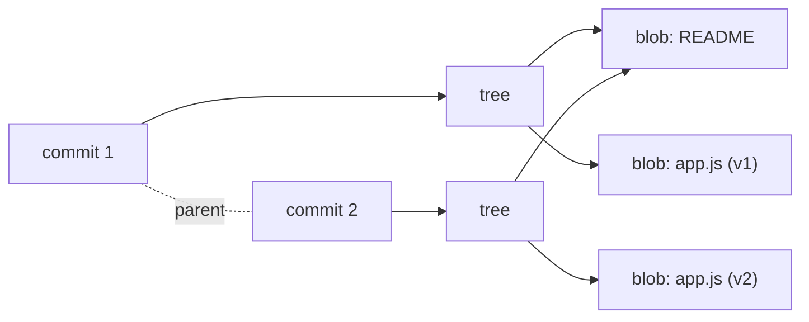

import ObjectModel from '../../components/ObjectModel.svelte';
import CommitBlockchain from '../../components/CommitBlockchain.svelte';
import HeadRefsTimeline from '../../components/HeadRefsTimeline.svelte';

## The Git object model (blobs, trees, commits)

From this point on, we'll dive into more advanced Git concepts. If you need more time, feel free to review Chapters 1 to 6 before proceeding.

The beauty of Git lies in its ability to handle complex operations while maintaining a simple core. At its foundation, Git relies on objects to store and manage data. These objects are:

- Blob
- Tree
- Commit
- Tag

### Understanding Git objects

Every Git object consists of three elements:

- **Type:** the type of object (blob, tree, commit, or tag).
- **Size:** the size of the object's content.
- **Content:** the actual data stored in the object.

Each object plays a distinct role in how Git manages your project's history. Step through how a single commit references your whole project:

<ObjectModel client:visible />

- **Blob (Binary Large Object):**
  - Stores the content of a file.
  - Does not track filenames or directory structure, only the file's data.
- **Tree:**
  - Represents a directory.
  - Contains references to blobs (files) and other trees (subdirectories).
- **Commit:**
  - Points to a specific tree, representing the project's state at a certain moment.
  - Includes metadata like author, timestamp, and references to parent commits.
- **Tag:**
  - Marks a specific commit as important, typically for releases (e.g., v1.0.0).
  - Can be lightweight (a simple pointer) or annotated (with additional metadata).

### How Git uses these objects

Git is built around manipulating these four object types. It essentially creates a versioned filesystem that operates on top of your machine's filesystem. This structure allows Git to efficiently track changes, manage branches, and store project history in a lightweight manner.

## How Git stores changes (snapshots vs. diffs)

This is one of the biggest "aha" moments when learning Git internals, and it's where Git differs from most older version control systems.

Many tools (like Subversion) think in terms of **diffs**: they store the original file, then a list of changes (deltas) applied on top of it over time. To know what a file looks like at a given version, the system replays every change from the beginning.

Git takes a different approach. Git thinks in **snapshots**. Every time you commit, Git takes a picture of what all your tracked files look like at that moment and stores a reference to that snapshot. It's like a stream of mini file systems, one per commit.



:::tip
If a file did not change between two commits, Git is smart enough not to store it twice. It simply links to the identical blob it already has (notice how both trees above reuse the same README blob). So snapshots stay lightweight even on large projects.
:::

This is why operations like switching branches or viewing an old version are so fast: Git doesn't rebuild your files by replaying diffs, it just reads the snapshot that already exists. When Git _shows_ you a diff (for example in `git log -p`), it computes that difference on the fly by comparing two snapshots, but that's a presentation detail, not how the data is stored.

## Commits form a chain, like a blockchain

Here is one of the most useful mental models for Git: a commit behaves a lot like a block in a blockchain.

Every commit is identified by a hash computed from its content, its tree (the snapshot), its author, its message, and, crucially, the hash of its parent commit. Because the parent's hash is baked into the child, the commits form a tamper-evident chain. Change anything in an old commit and its hash changes, which changes the "parent" recorded in the next commit, which changes that commit's hash too, and so on, all the way to the tip.

Try it yourself. Edit a message in an early block, or hit "Tamper with commit #0", and watch the whole chain downstream re-hash:

<CommitBlockchain client:only="svelte" />

> 💡 This is exactly why you cannot quietly rewrite shared history. The moment you change an old commit, every later commit gets a new hash, and anyone who already has the original chain will spot the mismatch.

> 📖 The demo is simplified to keep the focus on the chaining. Git's real commit hashes are computed with SHA-1 (or SHA-256 in newer repositories) over the full commit object, whose format is roughly `commit <size>\0tree <hash>\nparent <hash>\nauthor ...\ncommitter ...\n\n<message>`. The principle is identical: the parent's hash is part of what gets hashed, so the history is cryptographically chained.

## Git references (HEAD, refs, tags)

Snapshots and objects are stored using their SHA-1 hash, a 40-character identifier like `85c035458122ca9f90a56fc2fa167bb61d22580b`. Nobody wants to type that. **References** (or "refs") are human-friendly names that point to those hashes, and Git uses them everywhere.

### Branches

A branch is simply a lightweight, movable pointer to a commit. It lives as a tiny file under `.git/refs/heads/`:

```sh
cat .git/refs/heads/main
# 85c035458122ca9f90a56fc2fa167bb61d22580b
```

When you make a new commit, Git updates that file to point to the new commit. That is literally all a branch is, which is why creating and deleting branches in Git is so cheap.

### HEAD

`HEAD` is a special reference that answers the question "where am I right now?". In most cases it doesn't point directly to a commit, it points to the branch you currently have checked out:

```sh
cat .git/HEAD
# ref: refs/heads/main
```

This indirection is what lets Git know which branch should move forward when you commit. As mentioned in [Chapter 2](/git-primer/setup/), if `HEAD` points straight at a commit instead of a branch, you are in a **detached HEAD** state.

Pointers are much easier to understand once you watch them move. Step through committing, switching branches, and detaching HEAD below. Pay attention to what moves: in many steps, only the pointers change, no files are copied:

<HeadRefsTimeline client:visible />

### Tags

A tag is a reference that points to a specific commit and, unlike a branch, is **not** meant to move. Tags are how you mark meaningful points in history, most commonly releases.

There are two kinds:

```sh
# Lightweight tag: just a named pointer to a commit
git tag v1.0.0

# Annotated tag: stores extra metadata (author, date, message) as its own object
git tag -a v1.0.0 -m "First stable release"
```

Annotated tags are recommended for releases because they record who created the tag and when. To share tags with the remote, remember they are not pushed by default:

```sh
git push origin --tags
```

### Putting it together

All of these references live under `.git/refs/`:

- `refs/heads/` holds your local branches.
- `refs/remotes/` holds your view of the remote branches (like `origin/main`).
- `refs/tags/` holds your tags.

So when you read a command like `git log main`, Git looks up `refs/heads/main`, finds the commit it points to, follows the parent links, and walks back through the snapshots. Once you see refs as nothing more than named pointers to commits, a lot of Git's "magic" stops feeling like magic.
