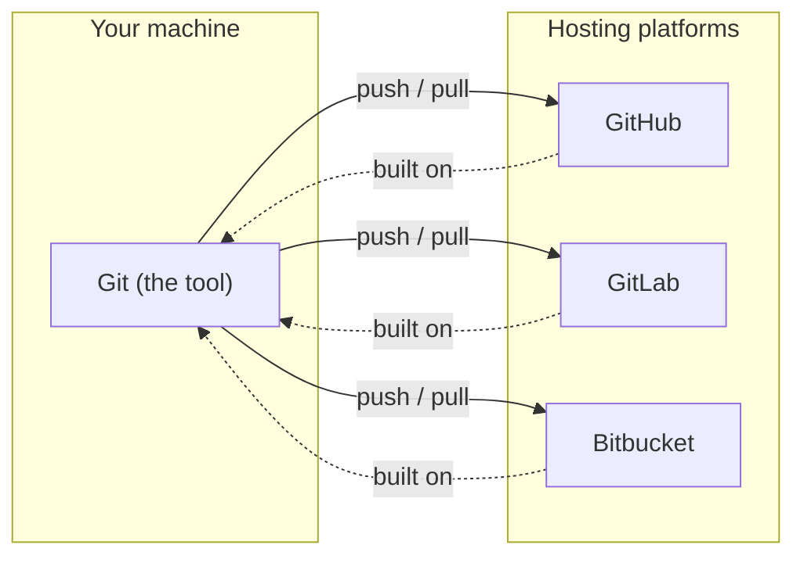

## What is Git? Why use it?

Git is a powerful, **distributed** version control system designed to track changes in files and collaborate with others on projects. **Distributed** is the key word: every clone is a full copy of the entire history, so you can commit, branch, and browse the past completely offline, with no central server to ask permission from. Whether it's source code, articles, or entire project files, Git ensures that you can easily manage and revert changes over time.

In any project, things are always evolving. Features are added, bugs are fixed, and sometimes mistakes happen. This is where Git becomes essential. It allows you to:

- **Track changes:** Git records every change made to your files, creating a detailed history of modifications.
- **Revert to previous versions:** Need to fix a bug or recover a deleted file? Git allows you to easily go back in time to a previous state of the project.
- **Collaborate with others:** Git allows multiple people to work on the same project simultaneously without overwriting each other's work.

While Git is primarily used through a command-line interface (CLI), which offers a robust set of tools, many graphical user interfaces (GUIs) have emerged to make Git more accessible for those who prefer visual tools.

Using Git ensures you can maintain a clean and organized history of your project, making it easier to track progress and avoid losing valuable work.

## Difference between Git and GitHub or GitLab

It's important to distinguish Git from platforms like GitHub and GitLab. **Git is the tool**; **GitHub and GitLab are hosting platforms built on top of it.** Git manages your project locally and enables distributed collaboration all on its own. GitHub and GitLab add a shared place to store repositories, plus pull requests, issues, and CI/CD around them.



These platforms provide centralized repositories to store and share your Git projects, collaborative tools for team communication and code reviews, and user-friendly interfaces to interact with Git. While GitHub or GitLab enhances your Git experience, they are not required to use Git, as Git can function independently, but these platforms need Git as their foundation.

Combining Git with platforms like GitHub or GitLab offers several advantages: ease of sharing projects with teammates or the broader community, seamless team collaboration with task assignments and issue tracking, backup and accessibility of your projects from anywhere via remote repositories, and additional tools like CI/CD pipelines, code analysis, and deployment automation.

Git is the backbone of modern version control, enabling teams to work efficiently and safeguard their projects, while platforms like GitHub and GitLab extend Git's capabilities by providing tools for collaboration, project management, and remote accessibility.

## Installing Git (Windows, macOS, Linux)

To install Git according to your work environment, please refer to this documentation: [Installing Git](https://git-scm.com/book/en/v2/Getting-Started-Installing-Git).

You can verify your installation at any time with:

```sh
git --version
```

## Basic Git configuration (git config)

When starting a new project with Git, you need to configure some general information. This information will be used for every commit and any operation that requires an author as metadata.

To configure your user details in Git, run the following commands:

```sh
# Set your name
git config --global user.name "firstname lastname"

# Set your email
git config --global user.email "your email"
```

These settings are stored globally, meaning they apply to all repositories on your system. If you want to set them for a specific repository only, omit the `--global` flag:

```sh
# Set user details for the current repository only
git config user.name "firstname lastname"
git config user.email "your email"
```

You can verify your configuration with:

```sh
git config --list
```

This will display all your current Git configurations.

There are multiple commands that can help you configure Git to suit your workflow. You can refer to the official documentation for a full list of options: [Git config documentation](https://git-scm.com/docs/git-config).

## Example .git/config File

After setting up your configurations, your `.git/config` file might look like this:

```ini
[user]
        name = John Doe
        email = john.doe@example.com

[core]
        editor = nano
        autocrlf = input

[alias]
        co = checkout
        br = branch
        ci = commit
        st = status
        lg = log --graph --pretty=format:'%Cred%h%Creset -%C(yellow)%d%Creset %s %Cgreen(%cr) %C(bold blue)<%an>%Creset' --abbrev-commit

[push]
        default = simple

[pull]
        rebase = false

[color]
        ui = true
```

Next up, we'll create an actual repository and look inside the `.git` folder. Continue to [Chapter 2](/git-primer/setup/).
