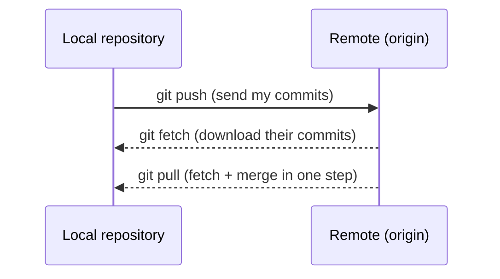

import RemoteSync from '../../components/RemoteSync.svelte';

## The push / fetch / pull cycle at a glance

Working with a remote is really just moving commits between two repositories: your **local** one and the **remote** (usually called `origin`). Before we dig into each command, play through the full cycle below. Watch closely what happens to `main` versus `origin/main`, especially during `fetch`.

<RemoteSync client:visible />

## Connecting to a remote (git remote add)

To work with a remote repository, Git needs to know where your code is hosted. You can configure one or more remote URLs in your repository. Each remote is assigned an alias to reference it easily instead of using the full URL.



### Adding a remote

To add a remote to a repository:

```sh
git remote add <remote-name> <remote-url>
```

- _remote-name_ is the alias for the remote (default: `origin`).
- _remote-url_ is the actual URL of the repository (e.g., GitHub, GitLab).

Example:

```sh
git remote add origin https://github.com/user/repository.git
```

### Updating a remote URL

If the remote repository's URL changes (e.g., after migrating to another platform), update it using:

```sh
git remote set-url <remote-name> <remote-url>
```

Example:

```sh
git remote set-url origin https://gitlab.com/user/repository.git
```

### Renaming a remote

If you need to rename a remote you can run:

```sh
git remote rename <old-name> <new-name>
```

Example:

```sh
git remote rename origin upstream
```

### Removing a remote

To remove a remote from your repository:

```sh
git remote remove <remote-name>
```

Example:

```sh
git remote remove origin
```

### Listing all remotes

To view all configured remotes:

```sh
git remote -v
```

This will display the remote names and their corresponding URLs.

## Pushing changes (git push)

### Basic usage

If you remember from [Chapter 3](/git-primer/basic-workflow/), until you push your code to the **remote repository**, it remains in your **local repository** and is only visible to you. To make your changes available to others, you need to use the push command. To push your current branch to the remote repository, run:

```sh
git push
```

By default, this will push your branch to its configured upstream branch (if one exists). If your branch has no upstream counterpart, Git will return an error:

```sh
fatal: The current branch <branch-name> has no upstream branch.
```

To explicitly specify the remote branch, use:

```sh
git push origin <branch-name>
```

This ensures that your local branch is pushed to the remote repository under the same name.

### When to use git push and git push origin 'branch'

While `git push` assumes the current branch and default remote (`origin`), there are cases where specifying the remote explicitly is necessary:

- **Multiple remotes:** if your repository has more than one remote, you must specify the correct one (e.g., `git push upstream main`).
- **Pushing to a different branch name:** if you need to push a local branch under a different name on the remote.
- **Using additional flags:** certain options like `--delete` require explicitly specifying the remote:

```sh
git push origin --delete feature-branch
```

Here is a recap:

| Command                       | Behavior                                                                                                                   |
| ----------------------------- | -------------------------------------------------------------------------------------------------------------------------- |
| `git push`                    | Pushes the current branch to its upstream branch (if set). If no upstream exists, it will return an error.                 |
| `git push origin`             | Pushes the current branch to the branch of the **same name** in `origin`, creating it on the remote if it doesn't exist yet (the first push won't set up tracking unless you add `-u`). |
| `git push origin <branch>`    | Pushes the specified branch to `origin`, regardless of the current checked-out branch.                                     |
| `git push -u origin <branch>` | Pushes the branch and **sets it as the upstream branch** (so future `git push` commands will work without specifying it).  |

### Git push flags

When pushing your code, you may need to perform additional actions beyond simply submitting changes. Git provides various flags to customize the `git push` command. Below is a summary of the most commonly used ones:

| Flag                    | Description                                                                        |
| ----------------------- | ---------------------------------------------------------------------------------- |
| `-u` / `--set-upstream` | Sets the upstream branch for the current branch (e.g., `git push -u origin main`). |
| `--force` / `-f`        | Forces the push, rewriting history if necessary (**use with caution!**).           |
| `--force-with-lease`    | Safer alternative to `--force`, ensuring no one else has pushed changes.           |
| `--delete`              | Deletes a branch from the remote (e.g., `git push origin --delete feature`).       |
| `--all`                 | Pushes all local branches to the remote.                                           |
| `--tags`                | Pushes all local tags to the remote repository.                                    |

## Fetching changes (git fetch)

Synchronizing your local repository with the remote one is crucial in Git. It ensures that your changes are submitted to others, while also allowing you to pull in changes from other contributors to stay up-to-date with the latest version of your project. Now that you know how to push your changes, let's cover how to fetch the changes made by others.

Getting your branch up to date with the remote is really **two separate steps**, and the important thing to understand is that `git fetch` only does the first one:

1. **Fetch:** download the latest commits from the remote into your local repository, updating your remote-tracking branches (like `origin/main`). Your own branch and your files are left untouched.
2. **Merge:** when you're ready, merge those fetched commits into your active branch.

Keeping them separate is exactly what makes `fetch` safe: you can download and inspect what changed before you let any of it touch your work. The most basic command to download updates is:

```sh
git fetch origin <branch>
```

This command downloads the latest changes from the remote repository into your local machine without merging them. This allows you to inspect the updates before integrating them into your own work.

Once you're ready to merge the fetched content into your active branch, run:

```sh
git merge origin/<branch-name>
```

This will bring in the updates from the remote branch and apply them to your current working branch. It's always a good idea to make sure your working directory is clean (i.e., no uncommitted changes) before performing a merge to avoid conflicts.

## Pulling updates (git pull)

Once you're comfortable with using `git fetch` and `git merge origin/<branch>`, you might want a quicker way to perform both actions in one go, especially if you don't need to inspect the code before merging it. The command you're looking for is:

```sh
git pull
```

This command automatically fetches the latest content from the default remote (usually `origin`) and merges it into your active branch. It's a convenient way to keep your local repository up-to-date without needing to manually run both commands.

If you want to pull updates from a specific branch, you can use:

```sh
git pull origin <branch>
```

This fetches and merges changes only from the specified branch on the remote repository into your current branch. It's helpful when you want to stay synced with a particular branch rather than all branches.

## Forking and contributing to open-source projects

Open-source projects are community-driven solutions designed to address a variety of problems, offering free-tier implementations that could range from extensions and software libraries to simple command-line tools. These projects rely on volunteers to help maintain, update, and fix them. Contributing to these projects is a great way to improve the software while giving back to the community.

At first, contributing to an open-source project might feel intimidating. After all, your code will be viewed by hundreds of people and used by even more. However, it's not as difficult as it seems, and it's an excellent opportunity to learn and connect with a community. Whether you decide to contribute because you've found a bug you want to fix or because you simply enjoy the project, the process is rewarding.

Before you start writing any code, there are a few steps you need to follow. This section will guide you through the setup process.

### Contributor guidelines

Most open-source projects include a `CONTRIBUTING.md` file. This document outlines the steps to get started as a contributor, including what tools to download, how to run the project locally, and any specific setup instructions. It's important to read this file carefully, as it will provide the rules and guidelines you need to follow in order to contribute effectively.

Once you've reviewed the guidelines, you'll need to create a copy of the repository in your Git hosting platform account, usually GitHub. This process is called "forking" the repository, and it allows you to make changes and submit pull requests (PRs) once you've addressed the issue you're working on.

To fork a project on GitHub, refer to the official documentation: [Forking a project](https://docs.github.com/en/pull-requests/collaborating-with-pull-requests/working-with-forks/fork-a-repo).

With your fork ready, you can now submit a pull request to the original project. Your fork will be referenced, and your code will be reviewed by other contributors. They'll decide whether to approve or reject your changes for inclusion in the main repository.

Remember, contributing isn't just about developing complex features. It can also include helping with documentation, answering questions in issues, or suggesting improvements. Every bit counts toward making the project better!
